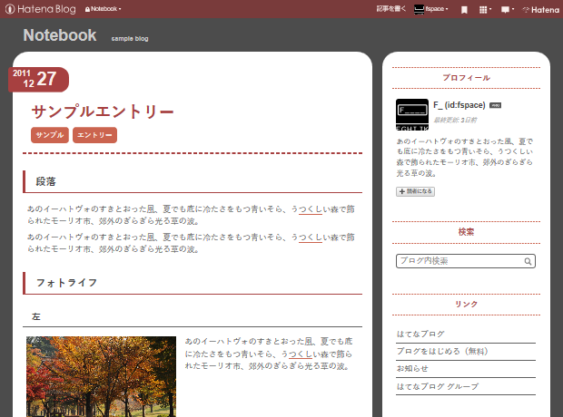

# Notebook

はてなブログテーマ『Notebook』のソースコードです。

詳細は[こちら](http://blog.hatena.ne.jp/-/store/theme/10328749687191215643)。

## カスタマイズについて

SASS(SCSS)にて記述しているためこれらをコンパイルできる環境が必要です。

全体的な色やサイズの調整は[\_variable.scss](/scss/_variable.scss)内の変数の値を変更することで可能です。

## License

[MIT](/LICENSE)
